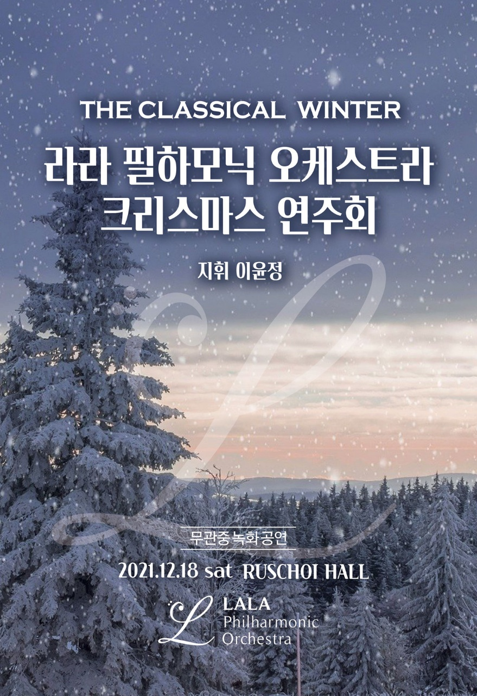

# LALA Philharmonic Orchestra, 2021

LALA Philharmonic  @ <a href='https://www.facebook.com/jskim.kr'>FB / Viloin </a>, [김진수](bigpycraft@gmail.com)

 

## 라라필하모닉 오케스트라          
<table border=0>
  <tr>
    <td width='30%'>
      
    </td>
    <td width='30%'>
      
    </td>
    <td width='30%'>
       
      
    </td>
  </tr>
</table>

<table border=0>
  <tr>
    <td width='50%'>
      
    </td>
    <td width='50%'>
      
    </td>
  </tr>
</table>

## Ensemble Sheet Music, 2021
- 10월 : [Second Waltz ][Msheet-10-1]
- 10월 : [When You Wish Upon a Star ][Msheet-10-2]
- 11월 : [Christmas Medley ][Msheet-11-1]

[Msheet-10-1]: ./sheet_music/10_second_waltz                            "Go Msheet-10-1"
[Msheet-10-2]: ./sheet_music/10_when_you_wish_upon_a_star        "Go Msheet-10-2"
[Msheet-11-1]: ./sheet_music/11_christmas_medley                       "Go Msheet-11-1"

